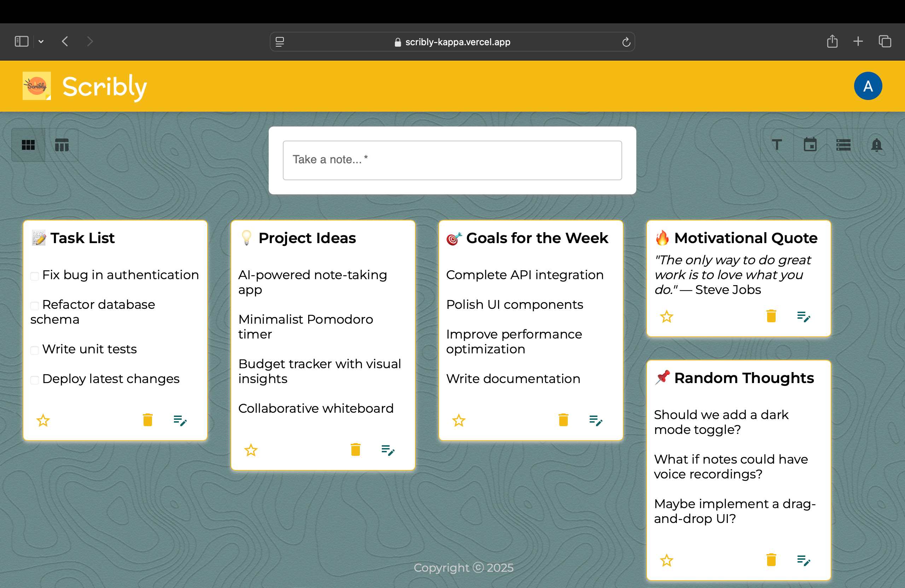

[![Contributors][contributors-shield]][contributors-url]
[![Forks][forks-shield]][forks-url]
[![Stargazers][stars-shield]][stars-url]
[![Issues][issues-shield]][issues-url]
[![LinkedIn][linkedin-shield]][linkedin-url]


<!-- PROJECT LOGO -->
<br /> 
<div align="center">
  <a href="https://github.com/akash85246/Scribly-backend">
    
  </a>

  <h3 align="center">SCRIBLY</h3>

  <p align="center">
    Effortless Sticky Notes with Smart Alerts & Customization!
    <br />
    <a href="https://github.com/akash85246/Scribly-backend/issues/new?labels=bug">Report Bug</a>
    ·
    <a href="https://github.com/akash85246/Scribly-backend/issues/new?labels=enhancement">Request Feature</a>
    .
    <a href="https://github.com/akash85246/Scribly-backend/blob/main/CONTRIBUTING.md">Contribute</a>
    .
    <a href="https://github.com/akash85246/Scribly-backend/pulls">Pull Requests</a>
    .
    <a href="https://github.com/akash85246/Scribly-backend/security">Report Security Issue</a>
    .
    <a href="https://github.com/akash85246/Scribly-backend/fork">Fork the Project</a>
  </p>
</div>


<!-- TABLE OF CONTENTS -->
<details>
  <summary>Table of Contents</summary>
  <ol>
    <li>
      <a href="#about-the-project">About The Project</a>
      <ul>
        <li><a href="#features">Features</a></li>
        <li><a href="#built-with">Built With</a></li>
      </ul>
    </li>
    <li>
      <a href="#getting-started">Getting Started</a>
      <ul>
        <li><a href="#prerequisites">Prerequisites</a></li>
        <li><a href="#installation">Installation</a></li>
      </ul>
    </li>
    <li><a href="#usage">Usage</a></li>
    <li><a href="#additional-notes">Additional Notes</a></li>
    <li><a href="#roadmap">Roadmap</a></li>
    <li><a href="#contributing">Contributing</a></li>
    <li><a href="#contact">Contact</a></li>
    <li><a href="#acknowledgments">Acknowledgments</a></li>
  </ol>
</details>


<!-- ABOUT THE PROJECT -->
## About The Project

[](public/Scribly-sample.png)

Scribly is a modern sticky note web app designed to enhance productivity and organization. With a sleek and intuitive interface, it allows users to effortlessly add, edit, delete, and organize notes. 

### Features  

- 🔐 **Google Authentication** – Secure authentication using OAuth2 with Passport.js  
- 🔔 **Push Notifications** – Send real-time alerts using **Web Push API**  
- 🛡️ **Data Sanitization** – Prevent XSS attacks with **DOMPurify** and **JSDOM**  
- 🔑 **JWT Authentication** – Secure user sessions with **JSON Web Tokens (JWT)**  
- 📅 **Automated Tasks** – Schedule background jobs with **Node-Cron**  
- 🔄 **Session Management** – Handle user sessions efficiently with **Express-Session**  
- 🗄️ **PostgreSQL Database** – Store and manage data with **pg (node-postgres)**  
- 🌐 **CORS Support** – Secure cross-origin requests with **CORS middleware**  
- 📝 **Markdown Parsing** – Render and sanitize user-generated content with **Marked.js**  


<p align="right">(<a href="#readme-top">back to top</a>)</p>


### Built With  

Powered by robust backend technologies for seamless performance and security.  

- [![Node.js][Node.js]][Node-url]   
- [![Express.js][Express.js]][Express-url]
- [![PostgreSQL][Postgres]][Postgresql-url] 
- [![Passport.js][Passport]][Passport-url] 
- [![JWT][JWT]][JWT-url] 
- [![Node-Cron][NodeCron]][NodeCron-url] 
- [![Web Push][WebPush]][WebPush-url] 
- [![CORS][CORS]][CORS-url]  
- [![Dotenv][Dotenv]][Dotenv-url] 
- [![Git][Git]][Git-url] 
- [![GitHub][GitHub]][GitHub-url]


<p align="right">(<a href="#readme-top">back to top</a>)</p>


<!-- GETTING STARTED -->
## Getting Started

Get started quickly with these easy setup instructions.

### Prerequisites  

Before setting up the project, ensure you have the following installed:  

- **Node.js** – [Download Node.js](https://nodejs.org/) (LTS version recommended)  
- **PostgreSQL** – Install and configure PostgreSQL for database management ([Download PostgreSQL](https://www.postgresql.org/download/))  
- **npm or Yarn** – Comes with Node.js; used to install project dependencies  
- **Git** – [Download Git](https://git-scm.com/) to clone the repository  
- **Railway Account** – If deploying on Railway, create a free account at [Railway](https://railway.app/)  
- **Google Cloud Project** – Set up a Google Cloud project for Google Authentication ([Guide](https://developers.google.com/identity))  
- **Web Push API Keys** – Generate keys for enabling push notifications ([Web Push Guide](https://developers.google.com/web/fundamentals/push-notifications))  
- **Environment Variables** – Create a `.env` file and configure the required variables (see `.env.example`)  

Additionally, having a basic understanding of the following will be helpful:  

- **Express.js** – For handling API requests efficiently  
- **JWT Authentication** – Secure user authentication using JSON Web Tokens  
- **Node-Cron** – For scheduling background tasks  
### Installation

Follow these steps to set up the project locally:

1. **Clone the Repository**
   ```bash
   git clone https://github.com/akash85246/Scribly-backend.git
   cd Scribly

2. Install Dependencies
    ```sh
   npm install
   ```
3. Set Up Environment Variables
   ```env 
   # Server Configuration
    PORT=5001
    BASE_URL=http://localhost:5001
    FRONTEND_URL=http://localhost:5174

    # Database Configuration
    DB_HOST=your_database_host
    DB_PORT=your_database_port
    DB_USER=your_database_user
    DB_PASSWORD=your_database_password
    DB_DATABASE=your_database_name
    DB_SSL=true  # Set to "true" if using SSL, otherwise "false"

    # Session Secret (for Express session)
    SESSION_SECRET=your_random_session_secret

    # Google OAuth Credentials
    GOOGLE_CLIENT_ID=your_google_client_id
    GOOGLE_CLIENT_SECRET=your_google_client_secret

    # JWT Secret (for authentication)
    JWT_SECRET=your_jwt_secret

    # Admin Configuration
    ADMIN_EMAIL=your_admin_email

    # Web Push Notifications (VAPID Keys)
    WEB_PUSH_PUBLIC_KEY=your_web_push_public_key
    WEB_PUSH_PRIVATE_KEY=your_web_push_private_key

   ```
4. Change git remote url to avoid accidental pushes to base project
   ```sh
   git remote set-url origin github_username/repo_name
   git remote -v # confirm the changes
   ```
5. Run the Project
    ```sh
   npm start
   ```

<p align="right">(<a href="#readme-top">back to top</a>)</p>


<!-- USAGE EXAMPLES -->
## Usage

Once the backend is running, it provides the following functionalities:

### 1. **User Authentication**
   - Supports **Google OAuth** for secure sign-in.
   - Generates and manages user sessions using **JWT tokens**.
   - Uses **Express sessions** for handling persistent login states.

### 2. **Sticky Note Management**
   - **Create Notes**: Users can add new notes with a title, content, and optional alert.
   - **Edit Notes**: Allows users to update the content of existing notes.
   - **Delete Notes**: Users can remove notes they no longer need.

### 3. **Push Notifications**
   - Sends **real-time push notifications** for alerts using `web-push`.
   - Users receive notifications when a note's alert time is triggered.

### 4. **User Session Management**
   - Uses **JWT-based authentication** for secure API access.
   - Implements session handling with `express-session` to manage login states.
   - Users can **log out securely**, clearing their sessions.

### 5. **Database Management**
   - **PostgreSQL** is used as the primary database.
   - Data is securely stored with optional **SSL support** for remote connections.
   - Uses **Knex.js** for query building and database transactions.

### 6. **Sorting & Filtering**
   - Supports **sorting and filtering** of notes by:
     - Title
     - Content
     - Creation date
     - Alert date

### 7. **Security Features**
   - Implements **CORS** policies to prevent unauthorized cross-origin requests.
   - Uses **DOMPurify & jsdom** to sanitize user inputs, preventing XSS attacks.
   - Supports **JWT token-based API authentication** for secure access.


## Additional Notes

- **Database Setup**: Ensure that **PostgreSQL is running** and the `.env` file is correctly configured.
- **Environment Variables**: Modify the `.env` file to set up API keys, database credentials, and authentication secrets.
- **Deployment**: Can be deployed on **Railway, Render, or any cloud-based Node.js server**.
- **Frontend Integration**: This backend is designed to work with the **Scribly frontend application**.

<p align="right">(<a href="#readme-top">back to top</a>)</p>


<!-- ROADMAP -->
## Roadmap  

Here are the planned improvements and features for the backend:  

- [x] **User Authentication** – Implement Google OAuth login.  
- [x] **JWT-based Authentication** – Secure API access using JSON Web Tokens.  
- [x] **Session Management** – Maintain user sessions with `express-session`.  
- [x] **Sticky Note API** – Enable adding, editing, and deleting notes.  
- [x] **Push Notifications** – Implement `web-push` for real-time alerts.  
- [x] **Database Integration** – Store and manage data with PostgreSQL.  
- [x] **Security Enhancements** – Implement CORS, input sanitization, and session protection.  
- [x] **Deployment Readiness** – Prepare for cloud deployment on **Railway** or other platforms.  

See the [open issues](https://github.com/akash85246/Scribly-backend/issues) for a full list of proposed features (and known issues).

<p align="right">(<a href="#readme-top">back to top</a>)</p>


<!-- CONTRIBUTING -->
## Contributing

Contributions are what make the open source community such an amazing place to learn, inspire, and create. Any contributions you make are **greatly appreciated**.

If you have a suggestion that would make this better, please fork the repo and create a pull request. You can also simply open an issue with the tag "enhancement".
Don't forget to give the project a star! Thanks again!

1. **Fork the Project**
   - Click the "Fork" button at the top-right corner of this page to create a copy of the repository in your GitHub account.

2. **Clone the Repository**
   - Clone your forked repository to your local machine:
     ```bash
     git clone https://github.com/your-username/Scribly-backend.git
     ```

3. **Create Your Feature Branch**
   - Navigate to your project folder and create a new branch for your feature:
     ```bash
     git checkout -b feature/AmazingFeature
     ```

4. **Commit Your Changes**
   - After making the necessary changes, commit them:
     ```bash
     git commit -m 'Add some AmazingFeature'
     ```

5. **Push to the Branch**
   - Push your changes to your forked repository:
     ```bash
     git push origin feature/AmazingFeature
     ```

6. **Open a Pull Request**
   - Go to the original repository (`akash85246/Scribly`), and open a pull request to merge your feature branch into the `main` branch.
   - Provide a brief description of the changes you've made and submit the pull request for review.

### Top contributors:

<a href="https://github.com/akash85246/Scribly-backend/graphs/contributors">
  
</a>

<p align="right">(<a href="#readme-top">back to top</a>)</p>

<!-- CONTACT -->
## Contact

Akash Rajput - [@akash_rajp91025](https://x.com/akash_rajp91025) - akash.rajput.dev@gmail.com

Project Link: [https://github.com/akash85246/Scribly-backend](https://github.com/akash85246/Scribly-backend)

<p align="right">(<a href="#readme-top">back to top</a>)</p>


<!-- ACKNOWLEDGMENTS -->
## Acknowledgments  

I would like to extend my gratitude to the following resources and technologies that made this project possible:  

- **Google Authentication** – For enabling secure OAuth-based user authentication.  
- **PostgreSQL** – For offering a reliable and scalable database solution.  
- **Node.js & Express.js** – For powering the backend and handling API requests efficiently.  
- **Passport.js** – For simplifying authentication and session management.  
- **JSON Web Token (JWT)** – For secure user authentication and API access control.  
- **Web Push API** – For enabling push notifications and real-time alerts.  
- **Node-Cron** – For scheduling background tasks and automated reminders.  
- **Dompurify & JSDOM** – For ensuring safe and sanitized HTML handling.  
- **MDN & DevDocs** – For providing excellent documentation and learning resources.  
- **Open Source Community** – For their contributions to the tools and libraries that made this backend possible. 

<p align="right">(<a href="#readme-top">back to top</a>)</p>


<!-- MARKDOWN LINKS & IMAGES -->
[contributors-shield]: https://img.shields.io/github/contributors/akash85246/Scribly-backend.svg?style=for-the-badge
[contributors-url]: https://github.com/akash85246/Scribly-backend/graphs/contributors
[forks-shield]: https://img.shields.io/github/forks/akash85246/Scribly-backend.svg?style=for-the-badge
[forks-url]: https://github.com/akash85246/Scribly-backend/network/members
[stars-shield]: https://img.shields.io/github/stars/akash85246/Scribly-backend.svg?style=for-the-badge
[stars-url]: https://github.com/akash85246/Scribly-backend/stargazers
[issues-shield]: https://img.shields.io/github/issues/akash85246/Scribly-backend.svg?style=for-the-badge
[issues-url]: https://github.com/akash85246/Scribly-backend/issues
[linkedin-shield]: https://img.shields.io/badge/-LinkedIn-black.svg?style=for-the-badge&logo=linkedin&colorB=555
[linkedin-url]: https://www.linkedin.com/in/akash-rajput-68226833a/
[product-screenshot]: ./public/images/ScriblyHome.png
<!-- Badges -->
[Node.js]: https://img.shields.io/badge/Node.js-339933?style=for-the-badge&logo=nodedotjs&logoColor=white  
[Express.js]: https://img.shields.io/badge/Express.js-000000?style=for-the-badge&logo=express&logoColor=white  
[Postgres]: https://img.shields.io/badge/PostgreSQL-316192?style=for-the-badge&logo=postgresql&logoColor=white  
[Passport]: https://img.shields.io/badge/Passport.js-34E27A?style=for-the-badge&logo=passport&logoColor=white  
[JWT]: https://img.shields.io/badge/JWT-black?style=for-the-badge&logo=jsonwebtokens&logoColor=white  
[NodeCron]: https://img.shields.io/badge/Node--Cron-ffcc00?style=for-the-badge&logo=javascript&logoColor=black  
[WebPush]: https://img.shields.io/badge/Web%20Push-5a0fc8?style=for-the-badge&logo=googlechrome&logoColor=white  
[CORS]: https://img.shields.io/badge/CORS-blue?style=for-the-badge  
[Dotenv]: https://img.shields.io/badge/Dotenv-ecd53f?style=for-the-badge&logo=dotenv&logoColor=black  
[Git]: https://img.shields.io/badge/Git-F05032?style=for-the-badge&logo=git&logoColor=white  
[GitHub]: https://img.shields.io/badge/GitHub-181717?style=for-the-badge&logo=github&logoColor=white  
[Railway]: https://img.shields.io/badge/Railway-0B0D0E?style=for-the-badge&logo=railway&logoColor=white  

<!-- URLs -->
[Node-url]: https://nodejs.org/  
[Express-url]: https://expressjs.com/  
[Postgresql-url]: https://www.postgresql.org/  
[Passport-url]: http://www.passportjs.org/  
[JWT-url]: https://jwt.io/  
[NodeCron-url]: https://www.npmjs.com/package/node-cron  
[WebPush-url]: https://developers.google.com/web/fundamentals/push-notifications  
[CORS-url]: https://developer.mozilla.org/en-US/docs/Web/HTTP/CORS  
[Dotenv-url]: https://www.npmjs.com/package/dotenv  
[Git-url]: https://git-scm.com/  
[GitHub-url]: https://github.com/  
[Railway-url]: https://railway.app/  